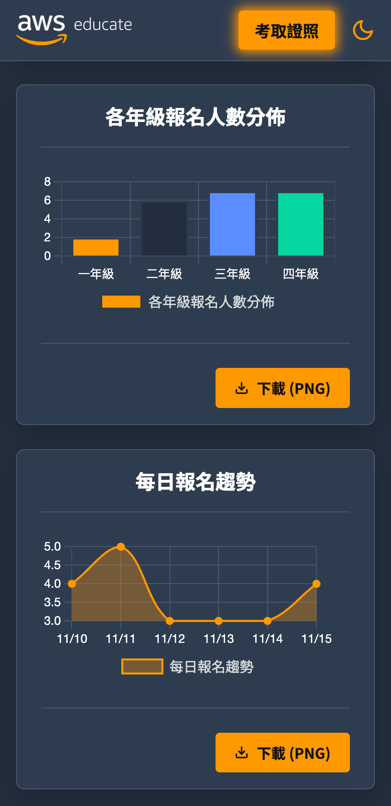
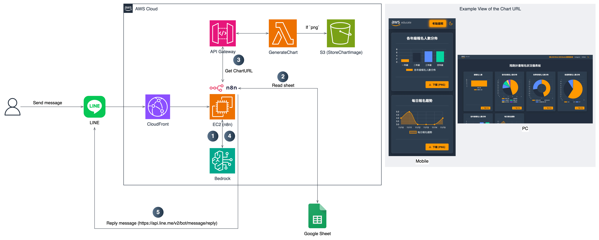

  

 
<h1 align="center">AWS x n8n 整合實戰：打造 LINE AI bot 助理</h1>

  
  
  </a>

歡迎來到 AWS Educate【AWS x n8n 整合實戰：打造 LINE AI Bot 助理】工作坊！

在本次工作坊中，我們會以「你是證照陪跑計畫的主辦人」這個情境為背景，帶你一步步學會如何使用 n8n 串接 LINE、Google Sheet、AWS Bedrock、Lambda 等服務，打造一個能回應使用者問題並自動產生圖表的 LINE AI Bot 助理。
最後，你也會實際練習如何在 AWS 上自架屬於自己的 n8n。

## Architecture Diagram

  

